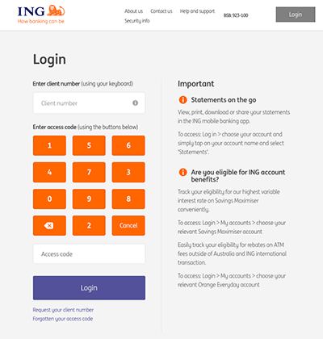

# ing-au-login

[](https://www.npmjs.com/package/ing-au-login)

Easily login to your ING Australia bank account using [puppeteer](https://pptr.dev/).

This code circumvents ING's "secure" login keypad by analysing the pixel data of the keypad images.



## Install via npm/yarn

```
yarn add ing-au-login
```

## API

```ts
export function login(browser: puppeteer.Browser, clientNumber: string, accessCode: string): Promise<string>
```

`login` returns an `auth token` wrapped in a `Promise` that can then be used to export the data you need. Alternatively, you can keep using your browser instance to collect what you require.

## Example: Export transaction list to CSV

```js
// replace with your account details
const CLIENT_NUMBER = '1234567'
const ACCESS_CODE = '1234'
const ACCOUNT_NUMBER = '12345678'

const axios = require('axios')
const qs = require('qs')
const fs = require('fs')
const moment = require('moment')
const puppeteer = require('puppeteer')
const { login } = require('ing-au-login')

;(async () => {
  const browser = await puppeteer.launch({ headless: false })
  const authToken = await login(browser, CLIENT_NUMBER, ACCESS_CODE)

  const csv = await fetchLast30Days(ACCOUNT_NUMBER, authToken)

  console.log(csv)

  await browser.close()
})()

function fetchLast30Days(accountNumber, authToken) {
  const url =
    'https://www.ing.com.au/api/ExportTransactions/Service/ExportTransactionsService.svc/json/ExportTransactions/ExportTransactions'
  const data = {
    'X-AuthToken': authToken,
    AccountNumber: accountNumber,
    Format: 'csv',
    FilterStartDate: moment()
      .subtract(30, 'days')
      .format('YYYY-MM-DDTHH:mm:ssZZ'),
    FilterEndDate: moment()
      .add(1, 'days')
      .format('YYYY-MM-DDTHH:mmssZZ'),
    IsSpecific: 'false',
  }
  return axios.post(url, qs.stringify(data)).then(response => response.data)
}
```
